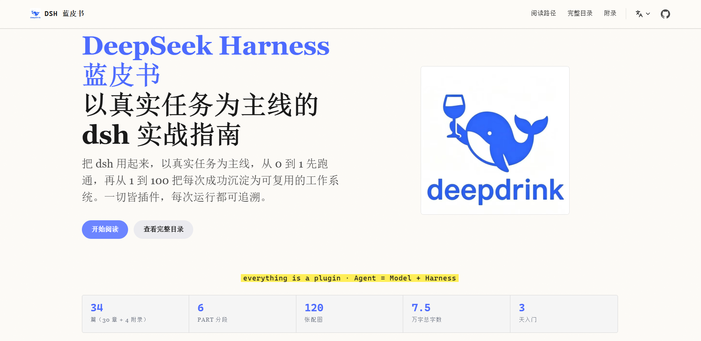

# DeepSeek Harness Bluebook

> [中文版本](./README_ZH.md) | English

A practical **DeepSeek Harness (dsh)** guide built around real tasks. From your first working Agent to a reusable work system — everything is a plugin, every run is traceable.

Built with **VitePress**, styled in **E-INK paper × DeepSeek ink blue**. Supports 6 languages.



## Features

- **Task-driven**: Every chapter comes from real hands-on practice — commands, screenshots, and errors are all real
- **6 languages**: Chinese (default), English, Japanese, Korean, Spanish, Portuguese
- **Plugin-first**: Built around dsh's "everything is a plugin" architecture — from installing to writing to publishing
- **E-INK style**: Paper-white background, ink text, fluorescent-yellow highlights, zero distracting animations
- **Image viewer**: Click to zoom, Ctrl+scroll to scale, arrow keys to navigate, drag to pan, ESC to exit

## Quick Start

```bash
# Install dependencies (pnpm >= 10)
pnpm install

# Local dev
pnpm docs:dev        # http://localhost:5173

# Build & preview
pnpm docs:build
pnpm docs:preview    # http://localhost:4173
```

## Project Structure

```
DeepSeekHarnessGuide/
├── docs/
│   ├── .vitepress/
│   │   ├── config.mts              # 6-language config (nav/sidebar/search)
│   │   └── theme/
│   │       ├── index.ts             # Theme entry + custom image lightbox
│   │       ├── style.css            # E-INK × DeepSeek blue styles
│   │       └── components/
│   │           ├── StatsBar.vue     # Homepage stats bar (i18n)
│   │           └── PathCards.vue    # Homepage reading path cards (i18n)
│   ├── public/
│   │   ├── logo.jpg
│   │   ├── robots.txt
│   │   └── assets/                  # Chapter images, organized by PART
│   ├── index.md                     # Chinese homepage (root / source language)
│   ├── part00/ ~ part06/           # Chinese chapters
│   ├── appendix/                    # Chinese appendices
│   └── en/ ja/ ko/ es/ pt/         # Other 5 languages (same structure as Chinese)
├── AGENTS.md                        # Writing conventions + multilingual workflow
├── CLAUDE.md                        # Sync copy of AGENTS.md
├── README.md
├── package.json
├── pnpm-lock.yaml
└── pnpm-workspace.yaml
```

## Chapter Structure

| PART | Theme |
|---|---|
| PART 00 | Opening: Why Agent's Lego Era, Reading Guide |
| PART 01 | From 0 to 1: Meet dsh, Install, Web UI, headless, Model Config, Troubleshooting |
| PART 02 | Understand the Skeleton: Plugin Tree, Core Subsystems & Message Flow, Session Log |
| PART 03 | Assemble Your Agent: Tools & Sandbox, MCP, Subagents, Skill, Scheduling, Local Deploy |
| PART 04 | Install, Write, Publish Plugins: Plugin Install, hello-plugin, Three Forms, defineTool, Hooks, UI, Publishing |
| PART 05 | Hands-on Scenarios: Personal Site, PPT, Video |
| PART 06 | Production & Ecosystem: Deployment, Security, Observability & Context |
| Appendix | Glossary, Command Cheatsheet, Learning Path, Interview Questions |

## Development Guide

### Adding a New Chapter

1. **Create the markdown file** in the appropriate PART directory for each language:
   ```
   docs/part0X/chXX.md          # Chinese (source)
   docs/en/part0X/chXX.md       # English
   docs/ja/part0X/chXX.md       # Japanese
   docs/ko/part0X/chXX.md       # Korean
   docs/es/part0X/chXX.md       # Spanish
   docs/pt/part0X/chXX.md       # Portuguese
   ```

2. **Register in sidebar** — open `docs/.vitepress/config.mts`, add the chapter link to **all 6 language sidebar configs** (`sidebarZh`, `sidebarEn`, `sidebarJa`, `sidebarKo`, `sidebarEs`, `sidebarPt`).

3. **Follow the writing template** — every chapter uses:
   ```markdown
   # CH XX · Chapter Title

   > 全文字数：X 字 · 预估耗时：约 Y 分钟 · 前置：...

   ## 本章目标
   ## 动手
   ## (section named by image content, e.g. "Web UI First Screen")
   ## 这一章你学到了什么
   ```

4. **Add images** to `docs/public/assets/<partXX>/` and reference with ``.

5. **Record changes** — write all Chinese changes to `changes.txt` in the project root. When ready, trigger translation (Chinese → English → other languages), then delete `changes.txt`.

### Writing Conventions

See [AGENTS.md](./AGENTS.md) for the full writing conventions, including:
- Content must be verifiable (real commands, real screenshots, no fabrication)
- De-AI-ified tone (first-person, real pitfalls, short sentences)
- No external URL exposure (always text + clickable link)
- Core concepts must have architecture diagrams (SVG, E-INK style)
- All demos use `deepseek-v4-flash-vision-exp`
- Hands-on chapters must include a "Let dsh do it: one prompt" section

### Multilingual Workflow

1. **Only edit Chinese** during daily changes
2. **Log changes** in `changes.txt` (fixed filename, append all changes)
3. **Translate on user command**: Chinese → English first, then English → other 4 languages
4. **Delete `changes.txt`** after all translations are complete

### Theme Customization

- Colors and styles: `docs/.vitepress/theme/style.css`
- Homepage components: `docs/.vitepress/theme/components/`
- Image lightbox: `docs/.vitepress/theme/index.ts` (supports zoom, pan, navigate, ESC)

## Deployment

Static site, output in `docs/.vitepress/dist/`. Deploy to any static host:
- EdgeOne Pages
- Vercel / Netlify
- GitHub Pages
- Cloudflare Pages

## Contributing

Contributions welcome! Please read [AGENTS.md](./AGENTS.md) before submitting PRs.

- Report issues or request content: [Issues](https://github.com/super-mortal/DeepSeekHarnessGuide/issues)
- Submit fixes or new chapters: [Pull Requests](https://github.com/super-mortal/DeepSeekHarnessGuide/pulls)
- Discuss: [Discussions](https://github.com/super-mortal/DeepSeekHarnessGuide/discussions)

## License

MIT License

---

GitHub: <https://github.com/super-mortal/DeepSeekHarnessGuide>
Author: [super-mortal](https://supermortal.cn)

## Learn AI, on L-Station

https://linux.do
